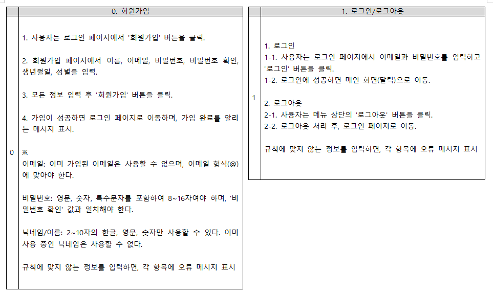
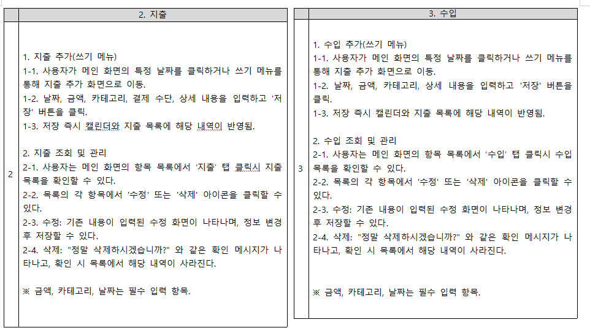
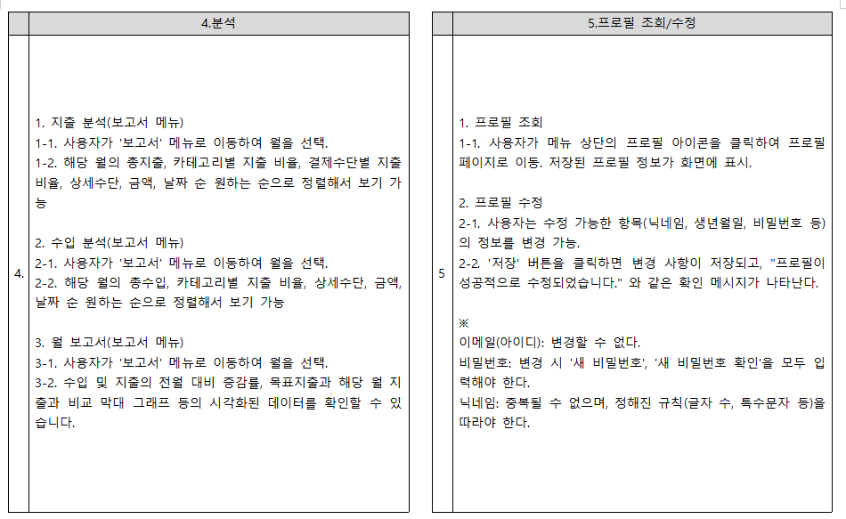
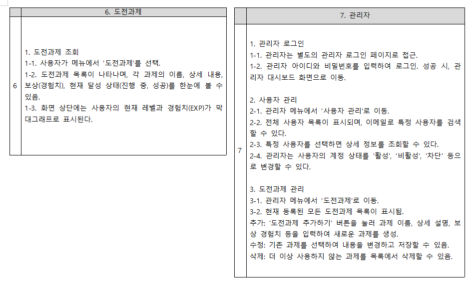
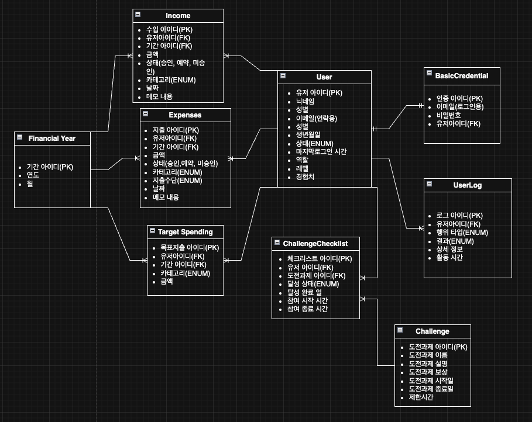
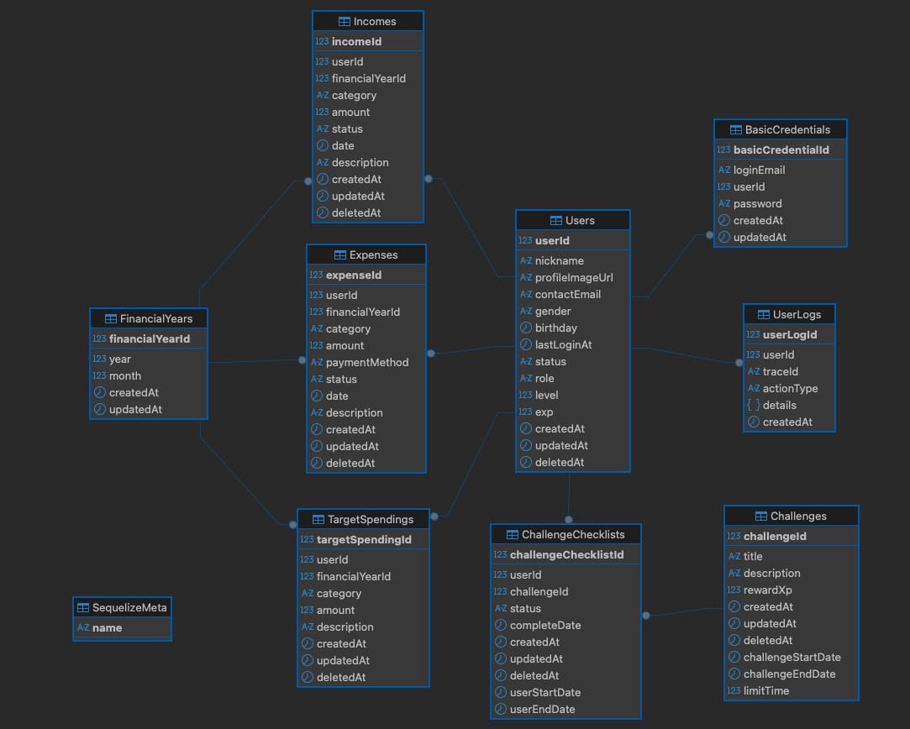

# 가계부 서비스 프로젝트

이 프로젝트는 사용자의 수입과 지출을 효율적으로 관리하고 분석할 수 있도록 돕는 웹 서비스입니다.

<br>

## 초기설계







<br>

## 주요 기능

-   **사용자 인증:** 이메일/비밀번호를 이용한 회원가입 및 로그인 (Passport.js, cookie, session)

-   **수입/지출 관리:** 수입(Income) 및 지출(Expense) 내역 CRUD

-   **목표 지출 관리:** 월별/카테고리별 목표 지출(TargetSpending) 설정 및 CRUD

-   **데이터 조회:** 연/월 별 수입, 지출, 목표 지출 내역 조회

-   **데이터 분석:** 전월대비 지출, 수입 증감량, 수입, 지출별 세부 분석

-   **API 문서화:** Swagger(OpenAPI 3.0)를 이용한 API 명세 자동화

## API 명세

서버 실행 후, 아래 주소에서 상세한 API 문서를 테스트해볼 수 있습니다.

-   **Swagger UI:** [http://localhost:3000/api-docs](http://localhost:3000/api-docs)

<br>


##  와이어프레임

프로젝트의 초기 화면 설계는 Figma를 사용하여 제작되었습니다. 아래 링크에서 전체 와이어프레임을 확인하실 수 있습니다.

-   **[Figma 와이어프레임 바로가기](https://www.figma.com/design/BeAGKHHE1RJ3U83fmQ6t8t/%EC%A0%9C%EB%AA%A9-%EC%97%86%EC%9D%8C?node-id=0-1&t=pzaADH3UY4CcNEcf-1)**

<br>

## 데이터베이스 구조

데이터베이스의 전체 구조는 Draw.io, DBeaver를 사용하여 설계되었습니다.

 



## 기술 스택
이 프로젝트는 Node.js(Express) 서버와 Docker를 통해 관리되는 데이터베이스(PostgreSQL) 및 메모리 DB(Redis)로 구성됩니다.

-   **백엔드:** Node.js, Express.js
-   **데이터베이스:** PostgreSQL, Sequelize 
    -   Sequelize ORM을 통해 Node.js 서버와 통신하며, `sequelize-cli`로 마이그레이션을 관리합니다.
-   **인증 및 세션:** **Passport.js**, **express-session**, **Redis**
    -   세션 데이터는 `docker-compose.yml`을 통해 실행되는 `Redis` 컨테이너에 저장됩니다.
-   **API 문서:** Swagger (OpenAPI 3.0)
    -   `swagger-cli`를 통해 `swagger/index.yaml` 파일을 `swagger.yaml`로 생성해서 `swagger-ui-express`로 제공합니다.


## 프로젝트 구조 
```text
expense-tracker/
├── src/                  # 핵심 소스 코드
│   ├── controllers/      # API 요청/응답 처리
│   ├── routers/          # 앤드포인트 정의 컨트롤러와 연결
│   ├── services/         # 핵심 비즈니스 로직
│   └── libs/             # 전반에 사용되는 공통 모듈
│         ├── common/     # 공용 함수
│         ├── config/     # 환경 변수 로드 (.env)
│         ├── constants   # ENUM 정의
│         ├── context     # 컨텍스트 관리
│         ├── db          # Sequelize 모델 정의 및 DB 연결 초기화
│         ├── logger      # Pino 로거 설정
│         ├── middlewares # 미들웨어 (인증, 유효성 검사 등)
│         └──  redis      # Redis 설정 및 연결
├── docs/images           # README 이미지 파일
├── server.js             # 서버 메인 파일
├── sequelizerc           # Sequelize-CLI 경로 설정 파일
├── README.md             # 프로젝트 개요 및 사용법
├── package-lock.json     # 정확한 종속성 버전이 기록된 파일로, 일관된 빌드를 보장
└── package.json          # 프로젝트 종속성 및 스크립트 정의
```


## 프로젝트 설정 및 실행

프로젝트를 로컬 환경에서 실행하기 위한 단계입니다.

### 1. 사전 준비 사항

* ** [Node.js](https://nodejs.org/) (v18 이상 권장)
* Node.js 서버(Express)를 사용자 컴퓨터에서 직접 실행하기 위해 필요합니다. <br>

* ** [Docker](https://www.docker.com/products/docker-desktop/) 및 Docker Compose
* `PostgreSQL`과 `Redis`를 컨테이너로 실행하기 위해 필요합니다. (로컬에 별도 설치 불필요)

<br>

| 파일 | 용도 | 설정 항목 (기본값) | <br> 
| **`docker-compose.yml`** | **Docker 컨테이너**가 사용할 환경 변수 | `POSTGRES_USER: user`/`POSTGRES_PASSWORD: password`<br/>`POSTGRES_DB: mydb` |
<br>

| **`config/config.json`** | **Node.js 애플리케이션**이 DB에 접속할 정보 | `"username": "user"`/`"password": "password"`<br/>`"database": "mydb"`<br/>`"host": "localhost"` |

만약 DB 정보를 변경하고 싶다면, **반드시 두 파일의 값을 모두** 동일하게 수정한 후 Docker 컨테이너와 Node.js 서버를 재시작해야 합니다.
<br>

### 2. NPM 패키지 설치
npm install

### 3. 데이터베이스 마이그레이션

* npx sequelize-cli db:create <br>
* npx sequelize-cli db:migrate

### 4. 서버 실행

  **서버 실행(npm run api-docs도 서버 실행시 먼저 실행되게 해두었음)** <br>

    npm run dev

    서버가 http://localhost:3000에서 정상적으로 실행됩니다.

<br>